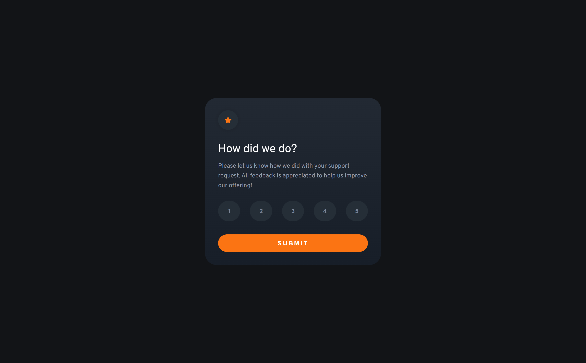
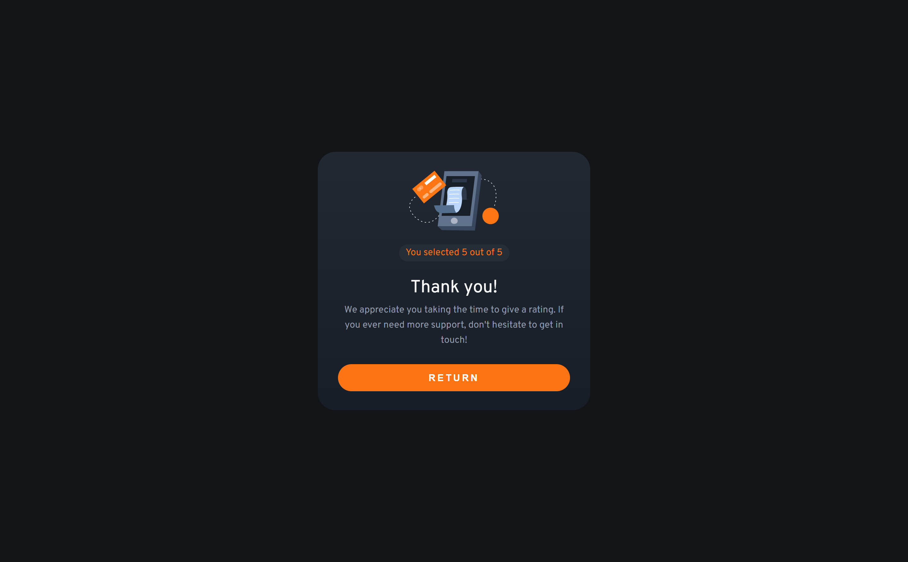

# 💻 Frontend Mentor - Interactive rating component

### Olá! 🌞

### Guia de conteúdo:

- [Visão geral](#visao-geral)
- [Processo](#processo)
  - [Tecnologias usadas](#tecnologias)
  - [O que aprendi](#o-que-aprendi)

### Visão geral
O desafio proposto é simples e pede a construção de um card de avaliação com o qual o usuário pode interagir escolhendo uma nota de 1 a 5 e recebendo uma mensagem de agradecimento.

### Processo
Mantive a estrutura HTML oferecida pelo site e para estilizar, apesar da simplicidade do desafio, usei SASS (.scss) para colocar em prática o que aprendi com o curso "SASS: CSS sintaticamente espetacular" da Alura. Na página de agradecimento coloquei um botão de retorno e fiz outras mudanças em relação ao design para encaixar melhor o botão no card.

Para a interação com o usuário, segui o HTML proposto que tinha a estrutura para as duas páginas no mesmo documento. Usei, então, uma classe ".hidden" com "display: none" para esconder a mensagem de agradecimento e mostrá-la com o clique no botão de envio.

### Tecnologias
- HTML
- SASS (.scss)
- JavaScript

### O que aprendi
Pratiquei um pouco mais o SASS (.scss), usando variáveis e aninhamento; revi o uso da pseudo-classe ":focus" para colocar o fundo cinza na nota escolhida; pratiquei o uso da estrutura "forEach" no JavaScript. 

### Meus perfis
   - [Front-end Mentor](https://www.frontendmentor.io/profile/instmi)
   - [Twitter](https://twitter.com/instmi_studies)
   - [LinkedIn](https://www.linkedin.com/in/milenaoandrade/)